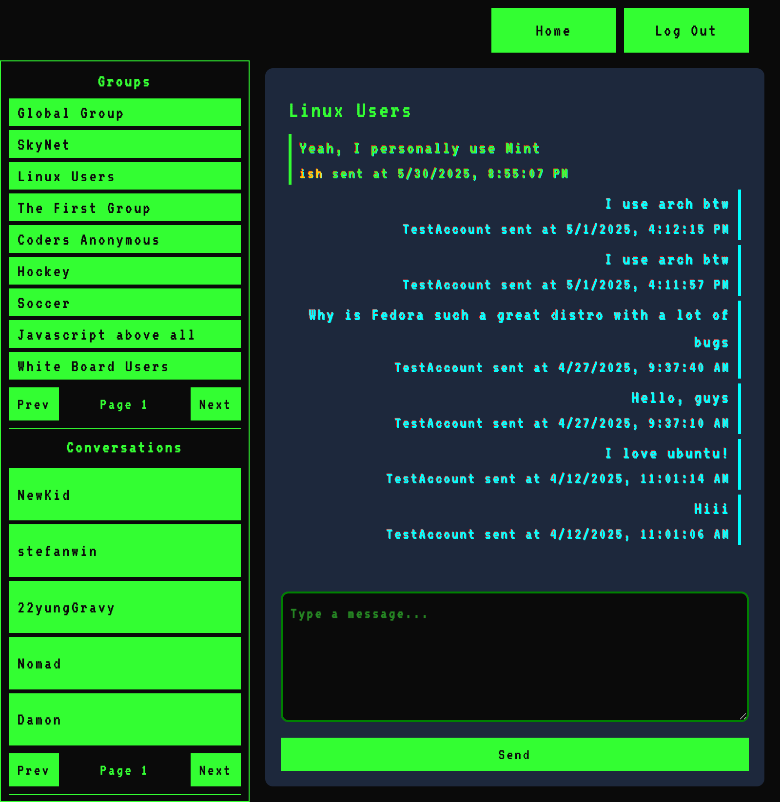
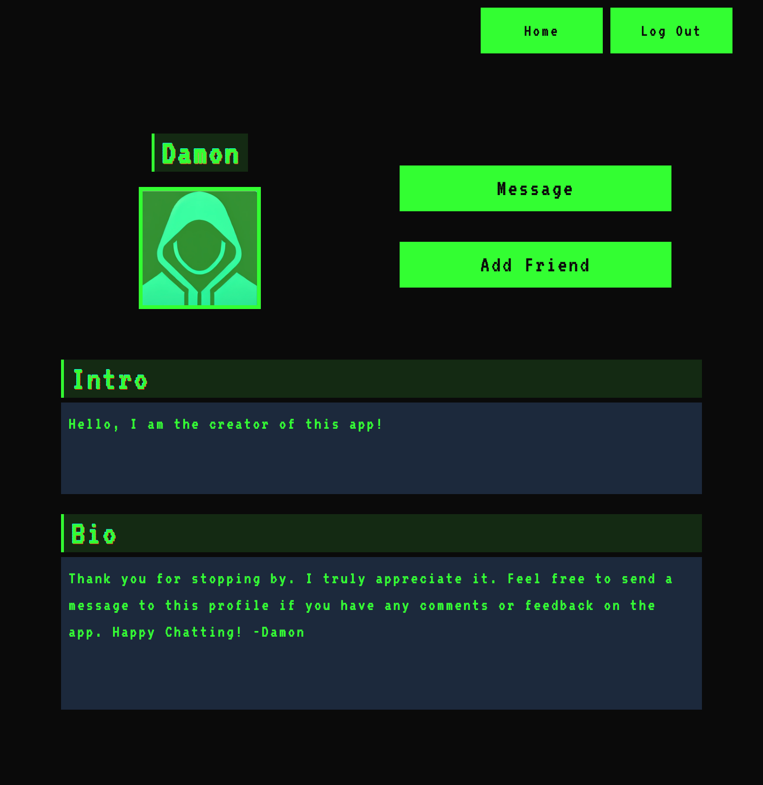

# [Messenger App](https://messaging-app-beta-six.vercel.app)

You can try it out without signing up by using the test account.  
Built as part of [The Odin Project’s messaging app assignment](https://www.theodinproject.com/lessons/nodejs-messaging-app)

---

---

## Project Overview

The app has three main parts:

1. **Backend API** hosted on Railway
2. **PostgreSQL database** managed with Prisma ORM, also hosted on Railway
3. **Frontend app** built with React and hosted on Vercel

---

## Tech Stack

- React, React Router, Vite, Tailwind
- Node.js, Express, TypeScript
- PostgreSQL, Prisma ORM
- JWT Auth, bcrypt
- API testing with SuperTest
- Analytics using Vercel and Simple Analytics

---

## Lessons Learned

- **Profanity Filtering**  
  I quickly had to learn about profanity filtering for this project, as the very first message sent by a user on my app was an inappropriate word I did not want associated with the application. Wow, profanity filters are a deep rabbit hole. There are many options for combating profanity and abusive language. Some of them include:

  1. Profanity blacklist - The option I used for my application. A profanity blacklist is a list of words that are not allowed to be used. The developer can choose to censor these words, or (as I did in this application) reject them altogether. There are many libraries available, but I chose leo-profanity as it is easy to use and does not rely on API calls. There are obvious drawbacks with this strategy though, as simple letter changes or anything that makes the strings not match exactly will get through the filter. The app is not meant for children, but there were some words I really wanted filtered out that it covers, so it works for my use case. In other applications, I might use a blacklist as a backup to a more robust filter.

  Adding regex to the mix -
  Some developers improve their blacklist by writing custom regular expressions (regex) to catch common workarounds. For example, replacing letters with symbols or adding random spaces. This lets you match words that would otherwise slip through a basic list. Regex helps, but it’s a constant game of cat and mouse. You’re basically guessing how creative people will be when trying to bypass your filter.

  2. Human Moderation - Having messages sit in a queue waiting for human approval before they are sent would account for context, be able to identify tricks users are doing to get words through, and be the most comprehensive filter available. The drawbacks are obvious though:

     - Messages are delayed and conversations could not happen in real time.
     - A moderater needs to constantly evaluated messages which requires time and/or money.

  Some developers get around these hurdles by having a report system. Messages go through a basic filter like the blacklist, and users can report messages that will then be reviewed and deleted by moderators. Websites like Reddit even use community moderators to avoid the financial impact of paid moderation.

  3. AI Filters - Send your message to an API endpoint that runs the message through an AI message moderator. This moderator can detect context and the level of toxicity in the tone of a message. There are obviously errors, but it is an interesting idea and seems like the best non-human way to filter messages. Cons are that it relies on an API endpoint that can fail or change, and using an outside service usually incurs a cost, especially at a larger scale. It also allows developers to identify abusive messages by context, something a blacklist would not be able to do effectively.

  4. Removal of Anonymity - Possibly the most interesting profanity filter is to remove user anonymity by having them create a verified account where users have to take accountability for their messages. Websites like LinkedIn, Facebook, and Instagram have users’ messages linked to their identity. Users tend to self-moderate better when other users know it’s them saying something. Cons include fake accounts, some people still not caring, and the fact that abuse can be more harmful when it does occur.

  While I only implemented option 1 in my small application, there are clearly many ways to filter out inappropriate user content. They all come with drawbacks, and combining multiple approaches seems to be the best technique.

  Still, many developers no doubt simply live with the idea that users will do what they will do.

- **Analytics Experiments**  
  I tried out Vercel Analytics and Simple Analytics to compare how they handle user tracking. Vercel uses hashed IP addresses to track unique visitors, so if someone visits more than once in a day, they still count as one. Simple Analytics doesn’t track IPs at all and instead uses referral data, which means each external visit counts separately. Both were easy to set up and didn’t need a cookie banner, which I liked.

- **Feature Creep**  
  I started adding a bunch of extras that weren’t part of the core idea. It slowed me down and I ended up removing most of them. I lost time working on features that didn’t make it into the final version.

- **Workflow Improvements**  
  I built the backend completely before starting the frontend, but once I got into the frontend, I had to change a lot of the backend anyway. It made me realize it would have been better to build one feature at a time from start to finish so I could test and adjust as I went. I’ll try that next time to save myself from doing work twice.

---

## Things I'd Do Differently or Expand On

- Switching to WebSockets would make the app feel more real-time by pushing messages directly to users instead of having them refresh to get updates.

- There are a lot of features I could add, like:
  - Message reactions
  - Admin controls for group chats
  - Pinned messages
  - Profile pictures
  - Image and file sharing

---

